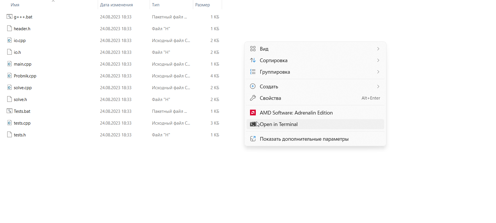
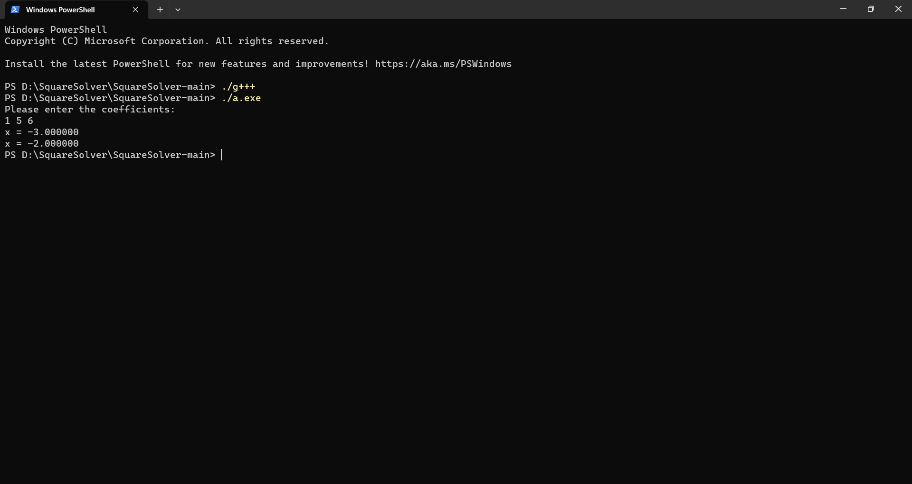

# **SquareSolver**

Моя программа SquareSolver умеет решать квадратное уравнение! 

# Запуск программы
Чтобы запустить программу нужно: 
1. Скачать файлы с [гитхаба](https://github.com/ludmilastemp/SquareSolver)

* Переходим по ссылке
* Нажимаем на зеленую кнопку Code

* Далее Download ZIP

2. Открыть в терминале папку, куда скачены файлы

* Открываем папку, куда скачали папку

* Разархивируем ее

* Открываем папку в терминале

3. Скомпилировать программу с помощью команды

        ./g+++

4. Запустить программу с помощью команды 

        ./a.exe

5. Ввести __три коэффициента__ квадратного уравнения 

6. Получить решения и радоваться!

# Тестирование 

Моя программа умеет тестировать сама себя!

Для этого нужно:
1. Сделать действия 1-2 раздела "Запуск программы" 
2. Скомпилировать программу с помощью команды

        ./Teats

3. Запустить программу с помощью команды 

        ./a.exe

4. Программа проверить правильность работы функции и напишет количество верно решенных тестов

